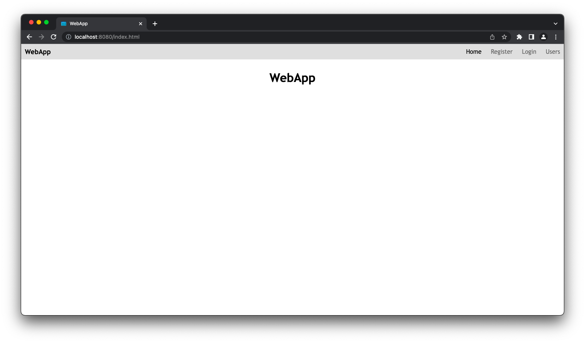
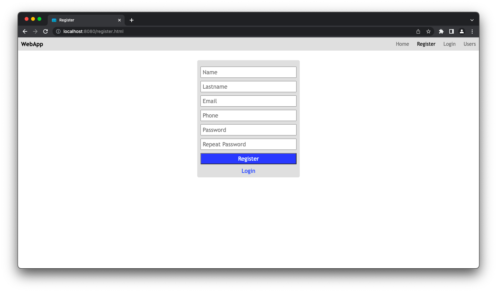
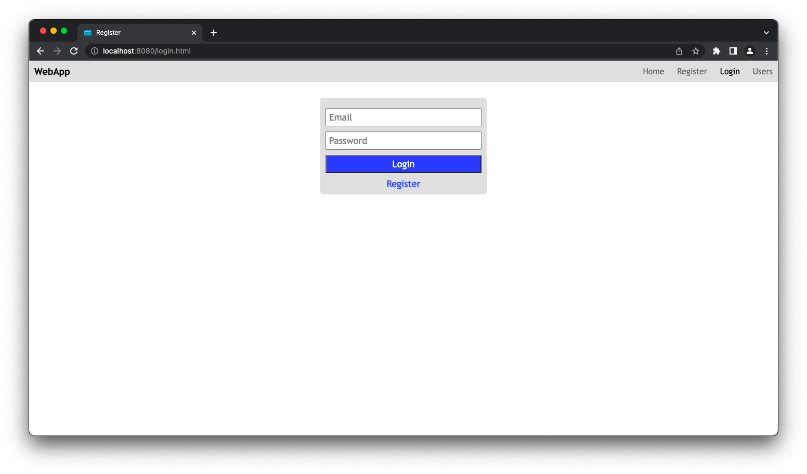
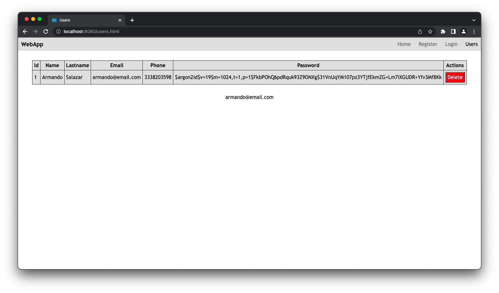

# WebApp with Spring
---
> **Note:** Update <version>1.18.30</version> in pom.xml file of lombok for fix the error in the project.
___
## Description
Web application and API Rest created with Spring and MySQL as database.
___
## Screenshots




___
## Create database
```mysql
CREATE DATABASE webapp_spring;
USE webapp_spring;
CREATE TABLE `users`
(
    `id`       int NOT NULL AUTO_INCREMENT,
    `name`     varchar(255) NULL,
    `lastname` varchar(255) NULL,
    `email`    varchar(255) NULL,
    `phone`    varchar(255) NULL,
    `password` varchar(255) NULL,
    PRIMARY KEY (`id`)
);
```
